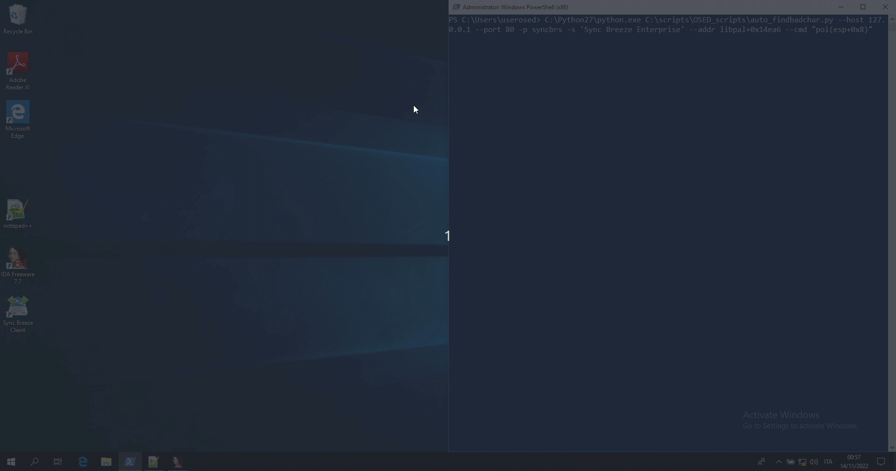

## Index

 - [description scripts](#description)

 - [installation](#installation)

 - [demo-1](#demo-1)


----

</br>

### Description

 - `map_shared_mem_example.py` : Map and manage the shared memory `Global\t1` with size of 512 bytes

 - `constants.py` : configuration settings

</br>

**compare_in_memory.py** 

 - Reach the breakpoint `<addr>` and save the memory location given by using the windbg expression `<cmd>` into the shared memory area defined by `map_shared_mem_example.py`. 

 - Example usage:
```
!py C:\scripts\OSED_scripts\compare_in_memory.py --addr libpal+0x14ea6 --cmd poi(esp+8)
```

 - Notes: 

    * After reaching the breakpoint, The `READY_OPCODE` bytes are also copied into the shared memory area before the content of the address given by `<cmd>`, which in this case is `poi(esp+8)` (the size of bytes is the value of 'mem_size' defined inside map_shared_mem_example.py). 

    * This was done for telling to the receiver that a new data was written by the sender. 

    * The receiver must read the content of the shared memory area and set the `CLEAN_OPCODE` in the starting position of the shared memory. 

    * Finally, the sender, which in our case is represented by the windbg python script, before writing again inside the shared memory area will check that `READY_OPCODE` is not present, otherwise will wait until `CLEAN_OPCODE` is set from the receiver
    
</br>

**auto_windbg.py**

 - This script does manage a process to be attached with windbg. 

    * If the process was not found then the service is restared. 

    * If no service was found then it is executed directly from windbg. 

    * Please note the variable 'prepend_cmd' inside constants.py are executed before `--commands <cmd>` argument

 - Example usage: Launch and attach syncbrs (syncbrs.exe) process to windbg, then launch windbg python script `compare_in_memory.py`
```ps1
C:\Python27\python.exe C:\scripts\OSED_scripts\auto_windbg.py -p syncbrs -s 'Sync Breeze Enterprise' -c "!py C:\scripts\OSED_scripts\compare_in_memory.py --addr libpal+0x14ea6 --cmd poi(esp+8)"
```

 - Helper:
```
usage: auto_windbg.py [-h] [-s SERVICE] -p PROC_NAME [-b BINARY_PATH]
                      [-c COMMANDS]

optional arguments:
  -h, --help            show this help message and exit
  -s SERVICE, --service SERVICE
                        Service to restart
  -p PROC_NAME, --proc_name PROC_NAME
                        Process name to attach with windbg If the process is
                        dead then restart it using the argument '--service' If
                        argument '--service' is not given, then use '--
                        binary_path'
  -b BINARY_PATH, --binary_path BINARY_PATH
                        Service to restart
  -c COMMANDS, --commands COMMANDS
                        Commands to execute after windbg has been launched
```

</br>


**auto_findbadchar.py**

 - Find bad chars "automatically"

    * `auto_windbg.py` and `compare_in_memory.py` are both used to instrument somehow the breakpoint

 - Let's analyse an example:
```
C:\Python27\python.exe C:\scripts\OSED_scripts\auto_findbadchar.py --host 127.0.0.1 --port 80 -p syncbrs -s 'Sync Breeze Enterprise' --addr libpal+0x14ea6 --cmd "poi(esp+8)"
```

 - What we are telling is that:

    * `--host` should be the local address

    * `--port` the port where the service is listening

    * The process to launch/restart and so the service given by the options `-p` and `-s`

    * `--addr` and `--cmd` arguments are used for executing the script `compare_in_memory.py`

    * The `--prefix` argument (default 'OOOK') is a string inserted above the bad chars, in this way we're sure that the sender is responding to our request


 - Please `note` that we also need to change :

    * `HDR` variable. Content to prepend with the data sent to HOST:PORT (save your HDR content inside C:\Temp\prefix.txt)

    * Inside `find_bad_char` method change the content between `#BEGIN` and `#END` sections

 - Helper:

```
usage: auto_findbadchar.py [-h] [--host HOST] [--port PORT] [-s SERVICE] -p
                           PROC_NAME [-b BINARY_PATH] --addr ADDR --cmd CMD
                           [--prefix PREFIX] [--bad_bytes BAD_BYTES] [--debug]

Find bad chars "automatically" Example usage: C:\Python27\python.exe
C:\scripts\OSED_scripts\auto_findbadchar.py --host 127.0.0.1 --port 80 -p
syncbrs -s 'Sync Breeze Enterprise' --addr libpal+0x14ea6 --cmd "poi(esp+0x8)"

optional arguments:
  -h, --help            show this help message and exit
  --host HOST           Ip address target (default: 127.0.0.1)
  --port PORT           Port target (default: 80)
  -s SERVICE, --service SERVICE
                        Service to restart
  -p PROC_NAME, --proc_name PROC_NAME
                        Process name to attach with windbg If the process is
                        dead then restart it using the argument '--service' If
                        argument '--service' is not given, then use '--
                        binary_path'
  -b BINARY_PATH, --binary_path BINARY_PATH
                        Service to restart
  --addr ADDR           Breakpoint address. Can be a constante or
                        <module_name>+<offset> if aslr is present
  --cmd CMD             Windbg expression for retrieving the address where to
                        compy from (e.g. poi(esp+0x10))
  --prefix PREFIX       In order to be sure the msg was correctly sent, a
                        prefix string is inserted with the input
  --bad_bytes BAD_BYTES
                        Default blacklist bytes. Input is given as list (e.g.
                        "[0,0x1,100]"
  --debug               Enable debug mode (default: False)
```

----

</br>

### Installation

 - Create folder `C:\scripts` and copy inside `OSED_scripts` folder

 - Change `constants.py` content according your env, in particular:

```python
# powershell path
powershell_path = 'C:\\Windows\\SysWOW64\\WindowsPowerShell\\v1.0\\powershell.exe'

# python path
PY_PATH = "C:\\Python27\\python.exe"

# windbg path
windbg_path = 'C:\\Program Files (x86)\\Windows Kits\\10\\Debuggers\\x86\\windbg.exe'

# windbg commands prepended by auto_windbg.py
prepend_cmd = ".load pykd.pyd; .scriptload C:/scripts/narly.js"
```


### Demo 1

 - Use `auto_findbadchar.py` for finding bad chars




